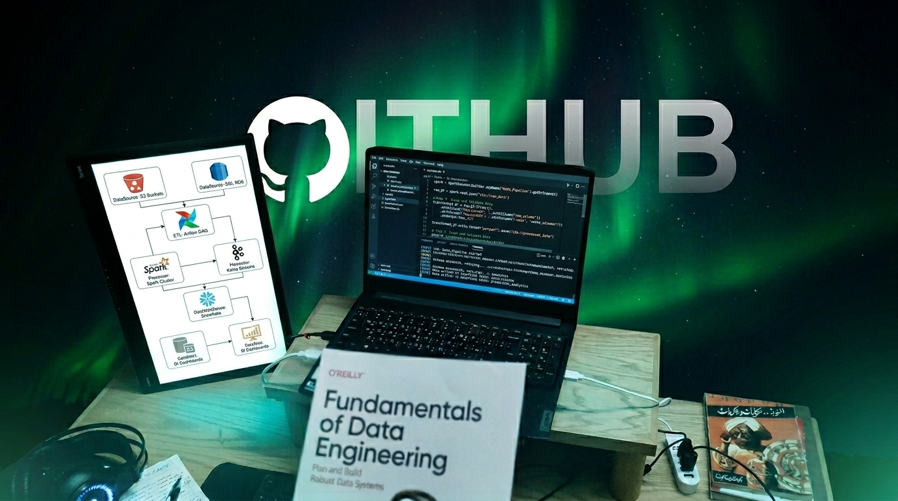

<div align="center">

<!-- ╔══════════════════════════════════════════════════════╗ -->
<!--              CUSTOM HEADER IMAGE                       -->
<!-- ╚══════════════════════════════════════════════════════╝ -->

<p align="center">
  
</p>

<br/><br/>

<!-- TYPING ANIMATION -->
<a href="https://github.com/Moamen-Ashraf">
  
</a>

<br/><br/>

<!-- SOCIAL BADGES -->
<a href="https://linkedin.com/in/momen-ashraf-">
  
</a>
<a href="https://github.com/Moamen-Ashraf">
  
</a>
<a href="https://leetcode.com/u/Momen-Ashraf">
  
</a>
<a href="mailto:momenashraf@example.com">
  
</a>

<br/><br/>


</div>

---

<!-- ══════════════════════════════════════════════════════════ -->
<!--                       ABOUT ME                           -->
<!-- ══════════════════════════════════════════════════════════ -->

<div align="center">
  <h2>⚡ About Me</h2>
</div>

```python
class MomenAshraf:
    location   = "Cairo, Egypt 🇪🇬"
    degree     = "B.Sc. Computer Science — Fayoum University (2024)"
    role       = "Aspiring Data Engineer"
    focus      = "Learning Data Engineering · Applying Projects · Mastering Big Data"
    stack      = ["Python", "SQL", "Spark", "Hadoop", "Airflow", "Power BI"]
    pipeline   = "Raw Data → Ingestion → Processing → Storage → Visualization"
    currently  = "Actively seeking Data Engineer roles in Egypt 🔍"
    fun_fact   = "I read 'Fundamentals of Data Engineering' for fun 📖"
```

> *"Don't just analyze data — engineer the systems that make analysis possible."*

---

<!-- ══════════════════════════════════════════════════════════ -->
<!--              🌱 LEARNING JOURNEY BANNER                  -->
<!-- ══════════════════════════════════════════════════════════ -->

<div align="center">

### 🌱 My Data Engineering Journey

<table>
<tr>
<td align="center" width="33%">

**📚 Learning**<br/>
`Data Engineering Fundamentals`<br/>
`dbt · Airflow · Kafka`<br/>
`Cloud Storage Concepts`

</td>
<td align="center" width="33%">

**🔨 Applying**<br/>
`End-to-End Pipelines`<br/>
`Spark + Hadoop Projects`<br/>
`Real-World Big Data Flows`

</td>
<td align="center" width="33%">

**🚀 Building**<br/>
`ETL / ELT Architectures`<br/>
`Data Warehouse Models`<br/>
`Portfolio on GitHub`

</td>
</tr>
</table>

</div>

---

<!-- ══════════════════════════════════════════════════════════ -->
<!--                      TECH STACK                          -->
<!-- ══════════════════════════════════════════════════════════ -->

<div align="center">
  <h2>🛠️ Tech Stack</h2>
</div>

**Languages**


**Big Data Engineering**


**Data & Analytics**


**Databases & Storage**


**DevOps & Infra**


---

<!-- ══════════════════════════════════════════════════════════ -->
<!--                   FEATURED PROJECTS                      -->
<!-- ══════════════════════════════════════════════════════════ -->

<div align="center">
  <h2>🚀 Featured Projects</h2>
</div>

<table>
<tr>
<td width="50%" valign="top">

### 🔄 [Big Data Pipeline](https://github.com/Moamen-Ashraf)
End-to-end data engineering pipeline — ingestion with **NiFi**, batch processing with **Spark**, stream processing with **Flink**, storage via **Hive** & **MongoDB**, deployed in **Docker**.


</td>
<td width="50%" valign="top">

### 🖼️ [Parallel Image Processing (MPI)](https://github.com/Moamen-Ashraf/parallel-image-processing-mpi)
High-performance image processing in **C++ + MPI + OpenCV**. Distributes filter workloads across CPU cores — a real-world demo of parallel data processing architecture.


</td>
</tr>
<tr>
<td width="50%" valign="top">

### 🧠 [LSTM Time Series Pipeline](https://github.com/Moamen-Ashraf)
ML data pipeline for sequential prediction — full flow from raw data ingestion, preprocessing with **Pandas**, model training with **Keras LSTM**, to output evaluation.


</td>
<td width="50%" valign="top">

### 🗄️ [SQL Engineering Practice](https://github.com/Moamen-Ashraf)
Organized **PostgreSQL** query solutions from DataLemur — window functions, CTEs, self-joins, set ops, keys. Structured like a real data engineer's reference library.


</td>
</tr>
</table>

---

<!-- ══════════════════════════════════════════════════════════ -->
<!--                    GITHUB STATS                          -->
<!-- ══════════════════════════════════════════════════════════ -->

<div align="center">
  <h2>📊 GitHub Stats</h2>

  
  

  <br/>

  

  <br/><br/>

  

</div>

---

<!-- ══════════════════════════════════════════════════════════ -->
<!--                  CURRENT FOCUS                           -->
<!-- ══════════════════════════════════════════════════════════ -->

<div align="center">
  <h2>🎯 Currently — Learning · Applying · Building</h2>
</div>

```yaml
📚 Learning Data Engineering:
  - "Fundamentals of Data Engineering" (O'Reilly) — in progress
  - dbt (data build tool) for analytics engineering
  - Apache Airflow for pipeline orchestration
  - Data Warehouse design: Star Schema, Kimball, SCD types

🔨 Applying in Real Projects:
  - Building end-to-end pipelines (NiFi → Spark → Hive → Power BI)
  - Practicing SQL for data engineering interviews (CTEs, window functions)
  - Dockerizing data workflows for reproducibility

🚀 Big Data Stack in Practice:
  - Hadoop HDFS + YARN for distributed storage & compute
  - Apache Spark for batch & micro-batch processing
  - Apache Flink for real-time stream processing
  - MongoDB for NoSQL storage layers
  - Kafka for event streaming (learning phase)
```

---

<!-- ══════════════════════════════════════════════════════════ -->
<!--                    CONTACT                               -->
<!-- ══════════════════════════════════════════════════════════ -->

<div align="center">
  <h2>📬 Let's Connect</h2>

  <a href="https://linkedin.com/in/momen-ashraf-">
    
  </a>
  &nbsp;
  <a href="https://github.com/Moamen-Ashraf">
    
  </a>
  &nbsp;
  <a href="mailto:momenashraf@example.com">
    
  </a>
  &nbsp;
  <a href="tel:+201129002822">
    
  </a>

</div>

---

<!-- ══════════════════════════════════════════════════════════ -->
<!--                       FOOTER                             -->
<!-- ══════════════════════════════════════════════════════════ -->

<div align="center">


*"Every great data product is built on a great data pipeline."* <br/>
**— Actively learning. Actively building. Ready to contribute. 🚀**

</div>
