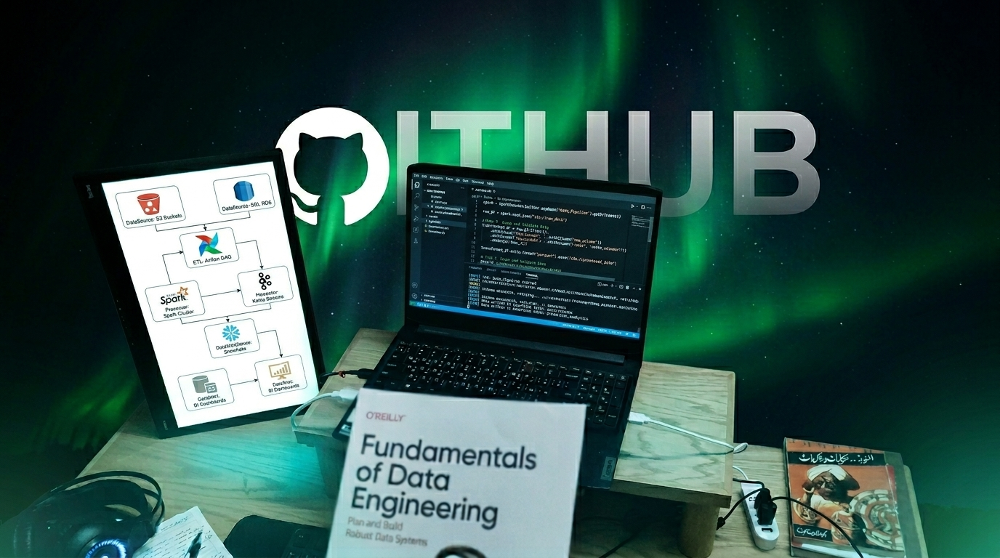

<!-- ╔══════════════════════════════════════════════════════╗ -->
<!--              CUSTOM HEADER IMAGE                       -->
<!-- ╚══════════════════════════════════════════════════════╝ -->

  

  

<h1 align="center">Hi 👋, I'm Momen Ashraf</h1>
<h3 align="center">Data Engineer | Data Analyst | Big Data Enthusiast</h3>

  
  
  
  

📍 Giza, Egypt &nbsp;|&nbsp; 📞 +20 102 315 7993

### 🧑‍💻 About Me

- 🔭 Data Analyst at **Raheed**, building Power BI dashboards and automating sales/inventory reporting across 2,100+ products
- 🌱 Currently expanding my skills into **Data Engineering** (ETL pipelines, Data Warehousing, Big Data tools)
- 🎓 B.Sc. in Computer Science — Faculty of Computers and Artificial Intelligence, Fayoum University (2020–2024)
- 📚 Completed **Advanced Big Data Training** at Orange Digital Centre (ODC): Hadoop, Spark, Flink, Hive, NiFi, MongoDB, PostgreSQL, Docker
- 💬 Ask me about SQL, Power BI, ETL pipelines, or Python data analysis
- ⚡ Fun fact: I turn messy spreadsheets into clean dashboards

### 🛠️ Tech Stack & Tools

**Languages**

  
  
  
  

**Data & BI**

  
  
  
  

**Big Data & Databases**

  
  
  
  

**Libraries**

  
  
  
  
  
  
  

**Software Development**

  
  
  
  

**Techniques:** Exploratory Data Analysis (EDA) · Data Cleaning & Wrangling · Web Scraping · Statistics & Probability · DSA · OOP · OS · Problem Solving

### 💼 Experience

**Data Analyst — Raheed** &nbsp;*(May 2026 – Present)*
- Analyze daily sales and inventory data using Excel, Google Sheets, Power BI, and Python to support business and operational decisions
- Build and maintain Power BI dashboards and weekly/monthly reports tracking sales trends, inventory levels, and key business KPIs
- Clean, analyze, and visualize data with Python and Power BI, turning raw data into actionable insights for management
- Provide inventory and sales analysis supporting stock optimization and data-driven decision-making
- Working across 2,100+ wedding products, supporting product analytics and inventory management

**Advanced Big Data Training — Orange Digital Centre (ODC)** &nbsp;*(Sep 2024 – Oct 2024)*
- Completed an intensive Big Data program covering Hadoop, Spark, Flink, Hive, NiFi, MongoDB, PostgreSQL, and Docker with a focus on practical, project-based learning

### 🚀 Featured Projects

<table>
<tr>
<td width="50%" valign="top">

#### 🗄️ SQL Server Data Warehouse
End-to-end data warehouse using **Medallion Architecture**, processing raw CSVs through Bronze, Silver, and Gold layers. Includes SQL-based ETL pipelines, stored procedures, and a Star Schema with fact/dimension tables and data quality checks.

</td>
<td width="50%" valign="top">

#### 🏥 Bed Availability Prediction Model
Flask web app using an **LSTM model** to predict hospital bed availability from historical time-series data. Full pipeline: preprocessing, feature scaling, model training with Keras/Joblib, and a results dashboard UI.
[repo](https://github.com/Moamen-Ashraf)

</td>
</tr>
<tr>
<td width="50%" valign="top">

#### 🖼️ Parallel Image Processing with MPI
Parallel image processing application distributing workloads across multiple processors for significant speedup, using **MPI** to parallelize pixel-level operations on computationally intensive tasks.
[repo](https://github.com/Moamen-Ashraf/parallel-image-processing-mpi)

</td>
<td width="50%" valign="top">

#### 📊 Big Data Pipeline
Practical, project-based big data pipeline covering ingestion, batch and stream processing, and storage — built during the ODC Advanced Big Data Training.

</td>
</tr>
</table>

### 🌱 Activities

- **Problem Solving Mentor**, ICPC – Fayoum University *(Sep 2022 – Mar 2023)* — Mentored students in online competitive programming and algorithmic problem solving. [repo]
- **Machine Learning Member**, Google Developer Student Club (GDSC) *(Oct 2022 – Jun 2023)* — Contributed to ML workshops and knowledge-sharing sessions for the university developer community. [repo]

### 📈 GitHub Stats

  
  

  

  📫 Reach me at <a href="mailto:momenashraf982@gmail.com">momenashraf982@gmail.com</a>

